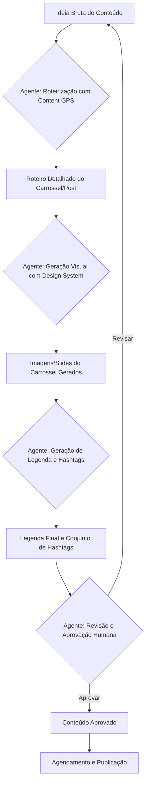

# Workflow de Produção e Automação de Conteúdo para Instagram

Este workflow detalha o processo automatizado de criação e publicação de conteúdo para o Instagram, garantindo que a consistência visual e narrativa do brand "Designer/Founder" seja mantida em escala.

---

## 1. Visão Geral do Fluxo

O processo se inicia com uma ideia bruta e culmina na publicação agendada do conteúdo, com a intervenção do agente de IA em etapas chave para garantir a automação e a aderência ao brand.

---

## 2. Etapas Detalhadas do Workflow

### 2.1. Ideação e Input Inicial (Usuário)
*   **Ação:** O usuário fornece uma ideia bruta para o conteúdo. Pode ser um tema, um problema a ser resolvido, um insight, ou um tópico específico.
*   **Formato:** Texto simples, bullet points, ou uma frase.
*   **Exemplo:** "Quero um carrossel sobre como evitar a procrastinação no trabalho." ou "Falar sobre a importância de ter um sistema de vendas."

### 2.2. Roteirização com Content GPS (Agente de IA)
*   **Ação:** O agente de IA recebe a ideia bruta e aplica o `Framework de Roteirização: Content GPS`.
*   **Processo:**
    1.  Identifica a "Prisão" e a "Liberdade" relacionadas à ideia.
    2.  Preenche o `Roteiro de 10 Slides` (ou adapta para outros formatos de post) com base na estrutura narrativa.
    3.  Gera o texto para cada slide/seção, seguindo as `Regras de Ouro do Conteúdo`.
*   **Output:** Um roteiro detalhado em Markdown, com o texto de cada slide e sugestões de função visual.

### 2.3. Geração Visual com Design System (Agente de IA)
*   **Ação:** O agente de IA recebe o roteiro detalhado e aplica a `Skill: Design System para Automação Visual`.
*   **Processo:**
    1.  Para cada slide/seção do roteiro, o agente consulta o `Mapeamento de Conteúdo para Template Visual`.
    2.  Seleciona o template visual mais adequado (ex: `template_matt_gray_style.png` para capa, `template_interna_matt_gray.png` para páginas internas).
    3.  Preenche o template com o texto gerado na etapa anterior, aplicando as `Regras de Aplicação Visual` (cores, fontes, elementos gráficos).
    4.  Gera a imagem final para cada slide/post.
*   **Output:** Um conjunto de imagens (PNG) para o carrossel ou post único, prontas para publicação.

### 2.4. Geração de Legenda e Hashtags (Agente de IA)
*   **Ação:** O agente de IA recebe o roteiro e as imagens geradas.
*   **Processo:**
    1.  Cria uma legenda persuasiva e envolvente, que complementa o conteúdo visual e segue o tom de voz do brand.
    2.  Inclui um "Gancho" inicial, um "Desenvolvimento" que resume o valor do post, e um "CTA" claro (ex: "Comente 'SISTEMA' para receber o guia").
    3.  Gera um conjunto de hashtags relevantes (5-10 hashtags de nicho, 3-5 hashtags amplas).
*   **Output:** Texto da legenda e lista de hashtags.

### 2.5. Revisão e Aprovação Humana (Usuário)
*   **Ação:** O usuário revisa o roteiro, as imagens, a legenda e as hashtags geradas.
*   **Processo:**
    1.  Verifica a precisão do conteúdo, a aderência ao brand e a qualidade geral.
    2.  Pode solicitar revisões ao agente de IA (voltando à etapa 2.2 ou 2.3).
    3.  Aprova o conteúdo para agendamento.
*   **Output:** Conteúdo final aprovado ou feedback para revisão.

### 2.6. Agendamento e Publicação (Ferramenta de Terceiros)
*   **Ação:** O conteúdo aprovado é agendado para publicação.
*   **Ferramentas:** Pode ser feito manualmente ou através de ferramentas de agendamento de terceiros (ex: Meta Business Suite, Later, Hootsuite).
*   **Output:** Post publicado no Instagram.

---

## 3. Integração com a Skill `designer-founder-branding`

A `designer-founder-branding` Skill atua como a base de conhecimento para as etapas 2.2 (Roteirização) e 2.3 (Geração Visual), fornecendo os frameworks, templates e regras que garantem a consistência e a qualidade do conteúdo gerado pelo agente de IA.

Este workflow, combinado com as Skills e frameworks definidos, cria um sistema robusto para a automação da sua presença no Instagram, permitindo escalar a produção de conteúdo de alta qualidade sem comprometer a identidade do seu brand.
