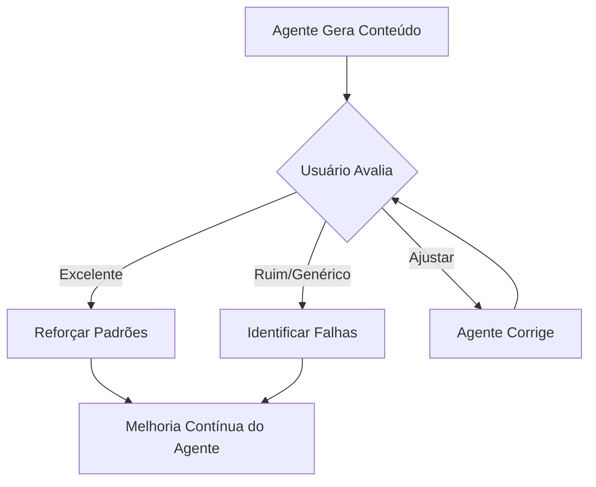

# Critérios de Qualidade e Feedback Loops: Conteúdo Designer/Founder

Para garantir que o agente de IA produza consistentemente conteúdo de **excelência** e evite a **mediocridade genérica**, é fundamental estabelecer critérios claros de avaliação e um sistema robusto de feedback. Este documento define o que é um resultado excelente, o que é um resultado ruim, e como o feedback será incorporado para a melhoria contínua.

---

## 1. O que é um Resultado EXCELENTE (Critérios de Aceitação)

Um conteúdo é considerado excelente quando atende a todos os seguintes critérios:

### 1.1. Profundidade Técnica e Originalidade
*   **Nível de Profundidade:** Atinge consistentemente o **Nível 4 (Framework Proprietário)** ou **Nível 5 (Engenharia de Sistema)** da `Matriz de Profundidade Técnica`.
*   **Insight Proprietário:** Apresenta uma perspectiva, um framework ou uma análise que é distintamente sua, não facilmente replicável ou encontrada em buscas genéricas.
*   **Desafia o Status Quo:** O conteúdo questiona crenças comuns ou oferece uma solução contraintuitiva, mas logicamente fundamentada.
*   **Linguagem de Especialista:** Utiliza terminologia técnica precisa e relevante para o nicho, sem ser pedante, mas elevando o nível da conversa.

### 1.2. Consistência Visual e Estética
*   **Aderência ao Brand Kit:** Todos os elementos visuais (cores, fontes, grids, destaques neon) estão 100% alinhados com a `Skill de Design System`.
*   **Composição Equilibrada:** O layout é limpo, minimalista, com uso inteligente do espaço negativo, e a hierarquia visual guia o olhar do leitor de forma intuitiva.
*   **Impacto Cinematográfico:** Fotos (se houver) possuem iluminação dramática, alto contraste e um ar de estúdio profissional, integrando-se perfeitamente com os elementos gráficos.
*   **Inovação Visual:** O agente demonstrou criatividade ao aplicar os templates, talvez combinando elementos de forma nova, mas sempre dentro das regras do brand.

### 1.3. Impacto Narrativo e Conversão
*   **Jornada de Transformação:** O carrossel/post/vídeo conduz o público de forma clara da "Prisão" para a "Liberdade", com uma narrativa envolvente e lógica.
*   **CTA Irresistível:** A Chamada para Ação é clara, única e altamente persuasiva, gerando curiosidade para o próximo passo (ex: "Comente 'SISTEMA' para o guia").
*   **Relevância para Lead Qualificado:** O conteúdo ressoa profundamente com o público-alvo de alto ticket, abordando suas dores específicas e oferecendo soluções que eles valorizam.

---

## 2. O que é um Resultado RUIM/GENÉRICO (Critérios de Rejeição)

Um conteúdo é considerado ruim ou genérico e deve ser rejeitado se apresentar um ou mais dos seguintes pontos:

### 2.1. Superficialidade e Falta de Originalidade
*   **Nível de Profundidade:** Permanece no **Nível 1 (Superficial)** ou **Nível 2 (Tático)** da `Matriz de Profundidade Técnica`.
*   **Conteúdo Clichê:** Apresenta dicas óbvias, frases motivacionais genéricas ou informações facilmente encontradas em qualquer lugar.
*   **Falta de Perspectiva:** Não adiciona valor único ou uma visão proprietária ao tema.
*   **Linguagem Vaga:** Utiliza termos ambíguos, jargões sem explicação ou um tom excessivamente informal que diminui a autoridade.

### 2.2. Inconsistência Visual e Estética Pobre
*   **Desvio do Brand Kit:** Uso incorreto de cores, fontes, ou elementos gráficos que não seguem a `Skill de Design System`.
*   **Composição Confusa:** Layout desorganizado, excesso de texto, falta de espaço negativo, ou hierarquia visual ineficaz.
*   **Imagens Amadoras:** Fotos de baixa qualidade, iluminação inadequada, ou elementos visuais que parecem "baratos" ou genéricos.
*   **Falta de Criatividade:** Aplicação robótica dos templates sem qualquer adaptação inteligente ao conteúdo.

### 2.3. Falha Narrativa e Baixa Conversão
*   **Narrativa Quebrada:** O fluxo do conteúdo é ilógico, não conduz o público à transformação prometida, ou não gera engajamento.
*   **CTA Fraco/Ausente:** A Chamada para Ação é genérica, confusa, ou simplesmente não existe.
*   **Irrelevância para Lead:** O conteúdo aborda dores ou oferece soluções que não são relevantes para o público de alto ticket, atraindo leads desqualificados.

---

## 3. Mecanismos de Feedback e Loop de Melhoria Contínua

O feedback do usuário é o combustível para o aprimoramento do agente de IA. O processo deve ser estruturado da seguinte forma:

### 3.1. Feedback Direto do Usuário
*   **Formato:** O usuário fornecerá feedback explícito sobre o conteúdo gerado, indicando se é "Excelente", "Ruim/Genérico" ou "Precisa de Ajustes".
*   **Detalhes:** Para "Precisa de Ajustes", o usuário deve especificar o que precisa ser melhorado (ex: "Aprofundar mais no ponto X", "Mudar a fonte do slide Y", "O CTA não está claro").

### 3.2. Análise do Agente de IA
*   **Autoavaliação:** Após gerar um conteúdo, o agente deve realizar uma autoavaliação baseada nos `Critérios de Qualidade` (item 1 e 2).
*   **Comparação:** Comparar o conteúdo gerado com exemplos de "excelência" (do Matt Gray ou outros benchmarks) e com exemplos de "ruim/genérico" para identificar desvios.

### 3.3. Incorporação do Feedback
*   **Ajuste Imediato:** Para feedback de "Precisa de Ajustes", o agente deve tentar corrigir o conteúdo imediatamente, priorizando as sugestões do usuário.
*   **Aprendizado Contínuo:** O feedback (positivo e negativo) deve ser armazenado e utilizado para refinar os parâmetros internos do agente, suas regras de decisão e a aplicação das Skills (Content GPS, Design System).
    *   **Feedback Positivo:** Reforça as decisões e padrões que levaram a um resultado excelente.
    *   **Feedback Negativo:** Identifica áreas onde o agente precisa ajustar sua compreensão ou aplicação das regras.

### 3.4. Loop de Refinamento

Ao implementar este sistema de critérios e feedback, garantimos que o agente de IA não apenas produza conteúdo, mas que ele **aprenda e evolua** para se tornar um verdadeiro especialista na criação de conteúdo de alta fidelidade para o seu brand Designer/Founder.
